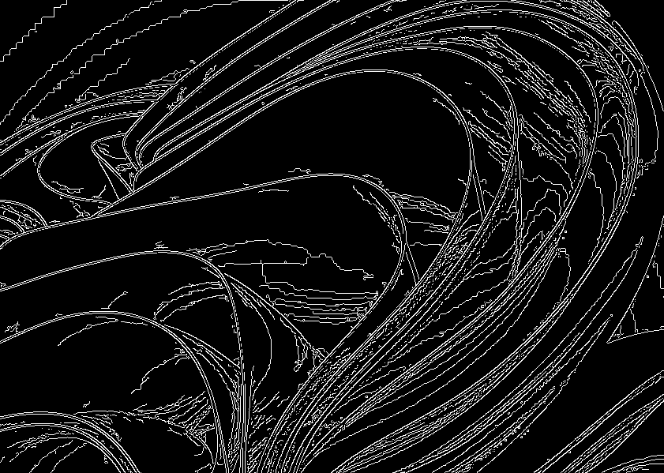

# line-extraction

閾値を指定して画像から線画抽出


## DEMO

|                  Original image                   |                 Line drawing extraction                 |
| :-----------------------------------------------: | :-----------------------------------------------------: |
|  |  |

## Requirement

### Interpreter

- Python

### Packages

#### Python

- opencv-python
- os
- sys

## ENV

実行環境

```plantext
[line-extraction] % python --version
Python 3.8.5
```

## Installation

python のパッケージは`requirements.txt`に記載してあります。直接インストールする際は

```bash
pip install -r requirements.txt
```

## Usage

### Exec directly

実行方法を簡単に説明します．

- `filename` : `input`ディレクトリ内の画像ファイルの**ファイル名**
- `lower_limit`: 整数で`edge`抽出の閾値の下限
- `upper_limit`: 整数で`edge`抽出の閾値の上限

```bash
git clone https://github.com/kkml4220/line-extraction.git
cd line-extraction
python line_extraction.py [filename] [lower_limit] [upper_limit]
```

#### Example of execution

`input/sample_background.png`を閾値の下限`lower_limit:1`，上限`upper_limit:10`で実行

```bash
python line_extraction.py sample_background.png 1 10
```

## Author

- 作成者 : 高橋 克征 (Takahashi Katsuyuki)
- E-mail : [Takahashi.Katsuyuki.github@gmail.com](Takahashi.Katsuyuki.github@gmail.com)

## License

"line-extraction" is under [MIT license](https://en.wikipedia.org/wiki/MIT_License).
